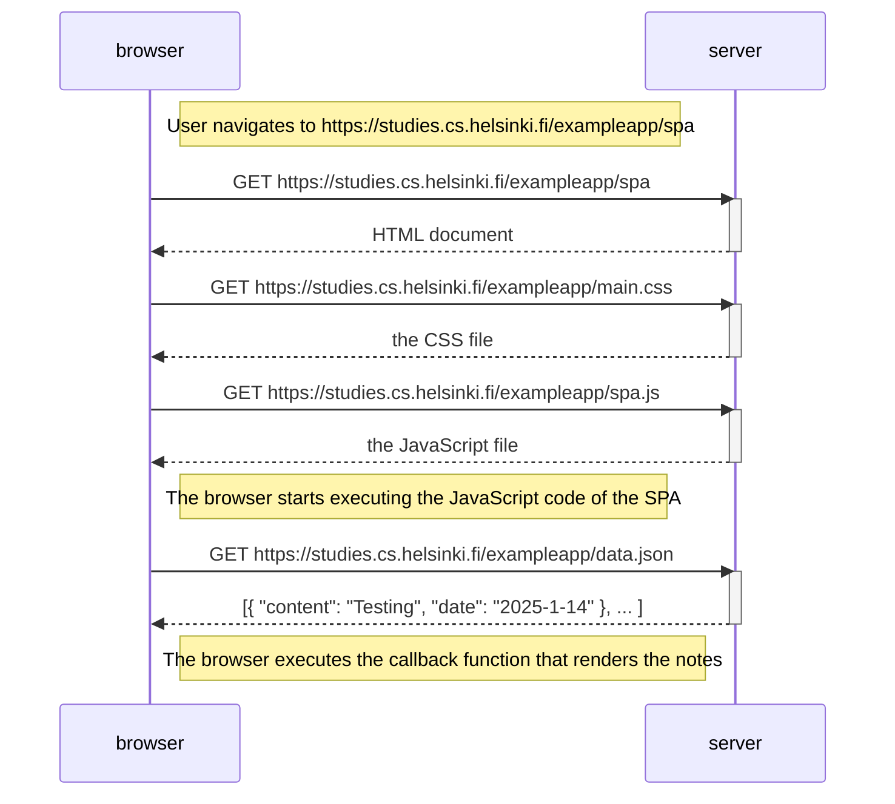

```mermaid
sequenceDiagram
    participant browser
    participant server

    Note right of browser: User navigates to https://studies.cs.helsinki.fi/exampleapp/spa
    browser->>server: GET https://studies.cs.helsinki.fi/exampleapp/spa
    activate server
    server-->>browser: HTML document
    deactivate server

    browser->>server: GET https://studies.cs.helsinki.fi/exampleapp/main.css
    activate server
    server-->>browser: the CSS file
    deactivate server

    browser->>server: GET https://studies.cs.helsinki.fi/exampleapp/spa.js
    activate server
    server-->>browser: the JavaScript file
    deactivate server

    Note right of browser: The browser starts executing the JavaScript code of the SPA

    browser->>server: GET https://studies.cs.helsinki.fi/exampleapp/data.json
    activate server
    server-->>browser: [{ "content": "Testing", "date": "2025-1-14" }, ... ]
    deactivate server

    Note right of browser: The browser executes the callback function that renders the notes

```